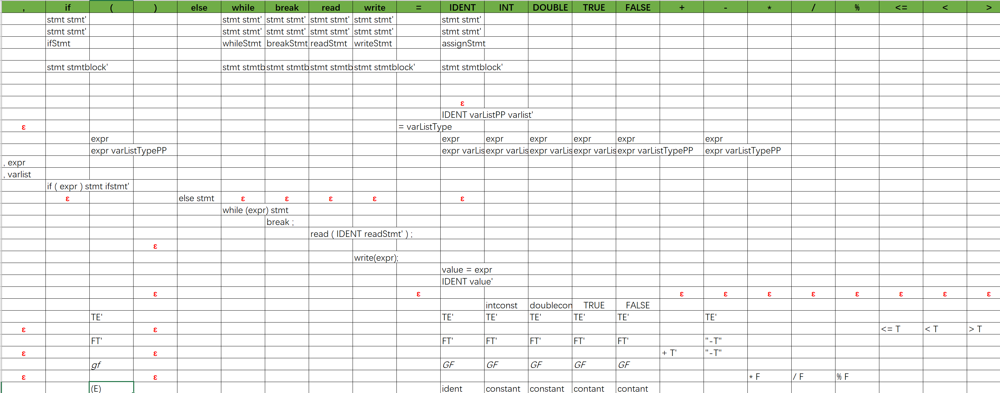

### CMM的语法

CMM是c的一个子集，其中实现了`int`， `double`类型的变量声明，赋值以及其他数值运算操作。同时可以识别`true` ，`false`关键字（布尔值运算时，认为0是false，所有非零的数为true）。

```c
int a = 1,b=2,c=3;
double f = 1.4,ff=1.45;
a = ((1+1)*(1+1))*((1+1)*(1+1));
```

同时也实现了一维数组的声明、赋值操作，例如`int[3] a = {1,2,3};`

```c
int[3] a= {1,2,3};
double[2] b = {1.1,2.2};
a[1]=a[2];
```

CMM也实现了c中绝大部分的控制流，for循环，while循环，if-else语句，break语句。

<!--more-->

```c
int i;
for(i=0;i<10;i++){
  int a = 1;
  write(a);
}
int a = -1;
while(true){
  if(a>0){
    break;
  }else{
    a=a+1;
  }
}
```

CMM实现了简单的函数，以及函数调用

```c
fun int getNum(){
  return 3;
}
fun int power(int a){
  if(a<1){
    return a;
  }
  return a*power(a-1);
}
write(power(getNum()));//递归调用
```

CMM实现了结构体，可以对结构体中的成员变量进行赋值等操作

```
struct A{
  int a;
  double b;
}
struct A x;
x.a=1;
x.b=1.2;
write(x.a);
write(x.b);

```

CMM可以`#include`其他文件，并且执行其他文件内的代码和函数


CMM也实现了输入`read()`,输出`write()`功能，可以读取或输出数

```c
write(1);
int a;
read(a);
```

### CMM实现的思路

#### 词法分析部分

词法部分使用了Antlr词法分析工具，分析词法，生成tokens


注：只使用了Antlr生成词法分析器的功能，语法分析为自己实现。

#### 语法分析部分

语法分析采用了LL1文法，部分LL1预测表如下。



#### 语义分析和中间代码生成

语义分析部分主要对变量的类型进行检查（许多暂时无法分析出的类型会在运行时进行报错），与中间代码生成同时进行。遍历整个语法树，检查声明的变量是否被赋予相同类型的值（double类型的变量可以接收int赋值），如果有错误则报错，否则生成中间代码。

中间代码采用四地址码的形式，形如：

```
23 pop 
24 jump 28
25 push 
26 write 0
27 pop 
28 DECL 1double b
29 MOV 0b 0.05
30 equal 0b 0.05 _t2
31 com _t2 0
32 jz 37
33 push 
34 write 1
35 pop 
36 jump 40
37 push 
38 write 0
39 pop 
40 pop 
```

一个四地址码中保存当前行数，操作数，操作符，以及一些特殊操作如（push，pop）；

目前，有一下几种操作符：

- add,minus,times,divide,mod,more,moreOrEqual,less,lessOrEqual,equal,notEqual：为算数或逻辑运算符，将t1与t2进行操作，后放入value中；

  `12 add t1 t2 a`

- DECL：声明操作，声明一个变量有`type`类型的变量`a`;

  `12 DECL int a`

- MOV：move操作，将t2的值赋值给t1；

  `12 MOV t1 t2`

- jump: 跳转操作，从当前行数调到`t`行继续执行；

  `12 jump t` 

- push, pop: push和pop操作为变量作用域的压入和弹出，当访问变量是，优先从最内部也就是栈顶的作用域开始访问。

- write，read：read为获取输入流的输入并赋值以及write为向输出流输出操作数；

- fun，\_end：为函数的标记，标记一个函数体在地址码中的位置，\_end表示函数体结束。

- com，jz：用于处理循环体以及if-else的控制流，com将比较两个操作数，如果为0则执行jz的操作；jz与jump功能一致，调到另一行开始执行。例如一段if-else的四地址码：

  ```c
  int a =1;
  if(a==1){
      write(a);
  }else{
      write(0);
  }
  //对应的四地址码
  1 DECL int a
  2 MOV a 1
  3 equal a 1 _t0
  4 com _t0 0
  5 jz 10
  6 push 
  7 write a
  8 pop 
  9 jump 13
  10 push 
  11 write 0
  12 pop 
  ```

- ret：对应`return`，将操作数返回给调用者；

- call：调用函数，操作数为函数名和一个指向调用时传递变量操作的结构尾部指针，例如：

  ```assembly
  1 fun main
  2 write 1
  3 MOV _s0 0
  4 ret _s0
  5 _end

  6 call main 8 # 8为调用main函数的jump行号
  7 DECL int _s0
  8 jump 2
  ```

- 操作数其中有用户声明的变量，以及一些临时变量如（\_t1,\_f1,_s0）（分别表示一般的临时变量，函数调用时，为参数列表传参的临时变量，以及返回值）；同时针对数组和结构体，其中使用了形如（1a,x#a,B.b）的临时变量，其中1a，开头的数字表示偏移量，a为数组名；x#a其中x为一个int类型的变量，作为偏移量，a为数组名；B.b有两种情况，当B.b为左值时，为引用，可以进行赋值，当B.b是右值时，为具体的数值。例如：

  ```c
  12 mov x#a A.a    #将A.a赋值给a[x]
  13 mov 0b y#R     #将R[y]赋值给b[0]
  ```

##### 中间代码的优化

目前针对代码中出现的重复计算操作进行了优化，例如：`a=(1+1)*(1+1)`，尚未优化前的四地址码如下：

```c
1 add 1 1 _t0
2 add 1 1 _t1
3 times _t0 _t1 _t2
4 mov a _t2
```

优化后如下：

```c
1 add 1 1 _t0
2 times _t0 _t0 _t1
3 mov a _t1
```

具体优化的实现：在进行算术运算时，每一次使用新的临时变量对之前的四地址码进行扫描，如果发现有相同的操作符并且操作符相同，则直接返回相同操作的临时变量，并不会执行运算操作；如果未发现，则正常执行。（由于使用的临时变量名唯一，暂不考虑作用域造成的影响，实际并未影响）。

#### SVM（Simple Virtual Machine）简易虚拟机的实现

SVM的主要功能是遍历生成的四地址码，逐行翻译解释，并且动态检查赋值类型，数组边界（上下界）。

SVM包含了一个存放变量栈（一个作用域有一个变量栈）的栈，这里使用数组模拟栈的实现。可以进行查询变量，取变量，push新的作用域，以及pop旧作用域的功能。查询的变量总是从栈顶（最内部的作用域）查找，到外部作用域。

### CMM实现的关键代码

#### 语法分析

采用的LL1文法预测的形式，使用一个栈存放非终结符，只看一个token，针对不同的token，推测不同的语法分析；同时生成语法数，`addNode()`操作为在当前的非终结符下添加子节点。部分代码展示如下：

```java
 private void stmt(Stack<Symbol> stack, Token token) throws Exception {
        switch (token.getType()) {
            case TleftBrace:
                stack.push(addNode(new NonTerminalSymbol(Type.stmtBlock)));
                break;
            case Tint:
            case Tdouble:
                stack.push(addNode(new NonTerminalSymbol(Type.varDecl)));
                break;
            case Tif:
                stack.push(addNode(new NonTerminalSymbol(Type.ifStmt)));
                break;
            case Twhile:
                stack.push(addNode(new NonTerminalSymbol(Type.whileStmt)));
                break;
            case Tbreak:
                stack.push(addNode(new NonTerminalSymbol(Type.breakStmt)));
                break;
            case Tread:
                stack.push(addNode(new NonTerminalSymbol(Type.readStmt)));
                break;
            case Twrite:
                stack.push(addNode(new NonTerminalSymbol(Type.writeStmt)));
                break;
            case Tident:
                stack.push(addNode(new NonTerminalSymbol(Type.assignStmt)));
                break;
            case Tfunction:
                stack.push(addNode(new NonTerminalSymbol(Type.funStmt)));
                break;
            case Treturn:
                stack.push(addNode(new NonTerminalSymbol(Type.returnStmt)));
                break;
            case Timport:
                stack.push(addNode(new NonTerminalSymbol(Type.importStmt)));
                break;
            case Tfor:
                stack.push(addNode(new NonTerminalSymbol(Type.forStmt)));
                break;
            case Tstruct:
                stack.push(addNode(new NonTerminalSymbol(Type.structStmt)));
                break;
            default:
                throw new TokenException(token);
        }
    }
```

栈中弹出的终结符则与token进行匹配，如果匹配上，则弹出，否则报错，抛出异常；代码如下：

```java
 @Override
    void expand(Stack<Symbol> stack, Queue<Token> queue) throws Exception {
        if (typeEqual(queue.peek())) {
            queue.poll();
        } else {
            if (queue.peek() == null) {
                throw new Exception("Some errors near the end");
            } else {
                throw new TokenException(queue.peek());
            }
        }
    }
```

#### 语义分析和中间代码生成

遍历语法树，将语法树翻译成线性四地址码，下面是部分实现：

- if语句，if语句需要其中结构需要jump操作，并且jump操作在进入if的时候不可知，所以需要进行代码**回填**。先放入一个需要回填的标签：

  ```java
     private void ifstmt(NonTerminalSymbol nonTerminalSymbol) throws Exception {
          String value = expr(nonTerminalSymbol.getNodes().get(3));
          CodeOrganizer.getCodeOrganizer().code.add(CodeOrganizer.getCodeOrganizer().line + " com " + value + " 0");
          CodeOrganizer.getCodeOrganizer().line++;
          CodeOrganizer.getCodeOrganizer().code.add(CodeOrganizer.getCodeOrganizer().line + " jz j?");
          CodeOrganizer.getCodeOrganizer().line++;
       //需要回填 j?
          CodeOrganizer.getCodeOrganizer().code.add(CodeOrganizer.getCodeOrganizer().line + " push ");
          CodeOrganizer.getCodeOrganizer().line++;
          stmt(nonTerminalSymbol.getNodes().get(1));
          ifstmtp(nonTerminalSymbol.getNodes().get(0));
      }
  ```

  在if-else，需要回填一个jump和一个jz，jz在执行else，或者在`if(){ stmt .. jz here}` 退出执行后回填，而if后的stmt，执行完后需要一个jump操作，等else执行完后进行回填。

  需要注意的是，进入if，while，for控制流的之后，作用域也发生了变化，所以在进入具体的控制流之前，需要添加一步push操作。具体作用域的实现在下文给出。

- while循环，while循环也需要回填一个jz操作，例如：

  ```assembly
  23 less x 6 _t6
  24 com _t6 0
  25 jz ?? #此处的jz在while循环体解释结束后执行
  26 push 
  27 MOV _t7 x
  28 write _t7#doubleArray
  29 add x 1 _t8
  30 MOV x _t8
  31 pop 
  32 jump 23
  ```

- for循环，for循环是在while循环的基础上，在while循环的四地址码上部添加赋值等操作，末尾添加每次执行后需要执行的操作（x++，z--）。

- 数组与结构体的赋值操作，数组可以遍历语法树获取偏移量，然后生成中间代码（数组越界检查在运行时）；结构体则使用特殊字符标记`.`，在解释器解释时，从变量表中查找相应成员变量，进行赋值；

- 中间代码优化，在获取临时变量时，对已生成的中间代码进行检查，发现具有相同的算数操作时，则返回之前相同操作的变量，并消灭当前重复中间代码。

  ```java
   public String getTemplateVariable(String op,String l,String r){
          ArrayList<String> list = CodeOrganizer.getCodeOrganizer().code;
          if(list.size()==0)
              return getTemplateVariable();
          for(int i =list.size()-1;i>=0;i--){
              String s = list.get(i);
              if(s.contains("fun")||s.contains("ret")){
                  break;
              }
              if(s.contains(op)){
                  StringTokenizer stringTokenizer = new StringTokenizer(s," ");
                  stringTokenizer.nextToken();
                  if(stringTokenizer.hasMoreTokens()&&stringTokenizer.nextToken().equals(op)){
                      if(stringTokenizer.hasMoreTokens()&&stringTokenizer.nextToken().equals(l)){
                          if(stringTokenizer.hasMoreTokens()&&stringTokenizer.nextToken().equals(r)){
                              if(stringTokenizer.hasMoreTokens()){
                                  String s1 = stringTokenizer.nextToken();
                                  variables.add(s1);
                                  return s1;
                              }
                          }
                      }
                  }
              }
          }
          return getTemplateVariable();
      }
  ```


#### SVM实现

简易虚拟机中，关键部分是如何判断正确的作用域，以及对运动时出现的类似数组越界等异常进行检查并抛出。这里使用identTable链表，模拟栈的操作，每次进入函数，或者while，if等控制流时，生成新的作用域并放置在头部，离开时则弹出。

```java
    private void enterScope() {
        IdentTable idt = new IdentTable();
        idt.next = identTable;
        identTable = idt;
    }
    private void exitScope() {
        if (identTable.next != null) {
            identTable = identTable.next;
        }
    }

```

动态类型检查发生在取变量，以及对变量进行赋值的时候，查看偏移量，检查是否越界。同是mov操作的时候，也进行类型检查。代码如下：

```java
for (Ident id : i.members) {
    if (id.name.equals(memName1)) {
        Ident idd = id.get(getNum(memName));
            String value = getVarValue(ss[3]);
                if (idd.type.equals("int")) {
                    if (value.contains(".")) {
                        throw new Exception("cannot cast double to int at: " + current);
                            } else {
                                idd.setValue(value);
                            }
                } else {
                idd.setValue(Double.parseDouble(value) + "");
            }
    return;
    }
}
```

#### IDE

CMM IDE 使用swing搭建，有最基本的文本编辑，保存功能。同时也可以运行代码；编译中间代码。

下面是run是的代码：

```java
 public void excute(String filePath) {
        ANTLRInputStream inputStream;

        try {
            inputStream = new ANTLRInputStream(new FileInputStream(filePath));
            CMMLexer cmmLexer = new CMMLexer(inputStream);
            Parser paser = new Parser(cmmLexer);
            paser.parser();
            InterCodeGen interCodeGen = new InterCodeGen(paser.getRoot());
            interCodeGen.interperte();
            CodeOrganizer.getCodeOrganizer().writeToFile();
            Svm svm = new Svm(new BufferedReader(new FileReader("target.txt")));
            svm.run();
        } catch (IOException e) {
            e.printStackTrace();
        } catch (Exception e) {
            e.printStackTrace();
            System.err.println(e.getMessage());
        }
    }
```

### 样例输出