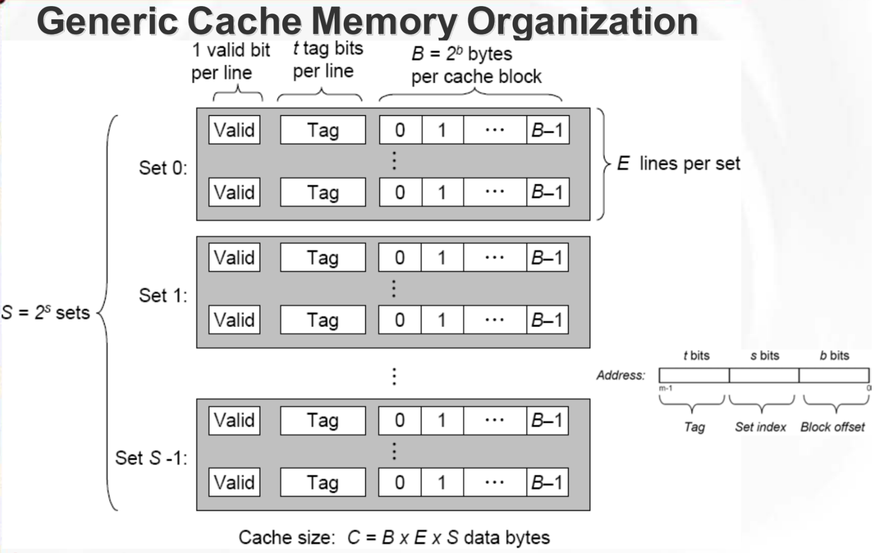
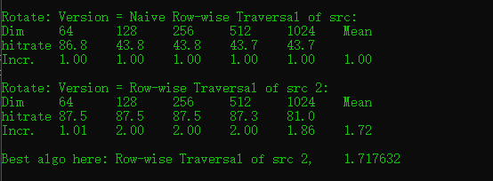
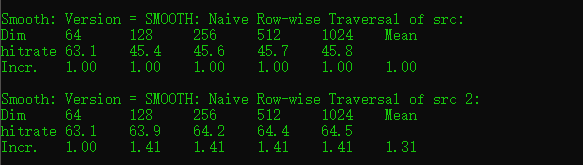

#### A Brief introduction to cache

Processors are generally able to perform operations on operands faster than the access time of large capacity main memory. Though semiconductor memory which can operate at speeds comparable with the operation of the processor exists, it is not economical to provide all the main memory with very high speed semiconductor memory. The problem can be alleviated by introducing a small block of high speed memory called a cache between the main memory and the processor.

<!--more-->



$S=2^S$: Number of sets

$E$: Number of lines per set

$B = 2^b$:Block size(bytes)

$m=log_2(M)$: Number of physical address bits

For example, in the lab there are a **16KB** direct-mapped cache, with **32 byte** cache lines. Here direct-mapped means each sets contain one set. Since the cache line is 32($2^5$) bytes, $b$ is 5 and $S= 16*1024/32=512$. Namely, the number of sets is 512, each set can hold $32/(32/8)=8$ pixels. Such that, if we fetch one pixel in memory to put it into cache, then, 7 pixels below that one are also put in cache. 

#### Rotate

As I have mentioned before, one set of cache can contains 8 pixels. In this exercise, we'll be optimizing rotate function designed to rotate an image 90 degrees anticlockwise. Thus, 8 pixel in one set mapped into 8 different cache in `dst` . And if we want to improve the hit ratio, we need to rotate small $8\times8$ squares(if the whole cache can store $8\times dim$ quadrilateral) at one time. Actually, when I write the function, we just to rotate a $8\times1$ metric(need 8 cache sets) to a $1\times8$ cache set, if the cache can hold a $8\times1$ pixels once.

```c++
char rotate_descr_2[] = "Row-wise Traversal of src from top to bottom";
void rotate_2(int dim, pixel*src, pixel*dst) {
	int row;
	if (dim < 1024) { to ensure the cache can hold a 8*1 metric
		row=8; 
	}else if (dim > 4096) { 
		row = 1; 
	}else{
		row = 4096 / dim;
	}
	int i, j;
	for (int k = 0; k < dim / row; k++) {
		for (j = 0; j < dim; j++) {
			for (i = 0; i < row; i++) {
				COPY(&dst[PIXEL(dim - 1 - j, i + row * k, dim)], &src[PIXEL(i + row * k, j, dim)]);
			}
		}
	}
}
```

The result is quite good.



#### Smooth

Different from rotating, which focus on special locality, When we do convolution to smooth image, to improve temporal locality is significant. To convolve one pixel needs 8 old pixels around it to do computation. Because one set of cache hold $1\times8$ pixels horizontally,  we can reuse the top three pixels and bottom three pixels.  One simple way to solve it is to smooth pixels row by row since we can reuse the top three pixels.

Here is the function code:

```c++
char smooth_descr_2[] = "SMOOTH: Naive Row-wise Traversal of src 2";
void smooth_2(int dim, pixel *src, pixel *dst) {
	int i, j;
	for (i = 0; i<dim; i++) {
		COPY(&dst[PIXEL(0, i, dim)], &src[PIXEL(0, i, dim)]);
	}
	for (i = 1; i<dim-1; i++) {
		for (j = 0; j<dim; j++) {
			if (j == 0 || j == dim - 1) {
				COPY(&dst[PIXEL(i, j, dim)], &src[PIXEL(i, j, dim)]);
				continue;
			}
			SMOOTH(&dst[PIXEL(i, j, dim)],
				&src[PIXEL(i, j, dim)],
				&src[PIXEL(i - 1, j, dim)],
				&src[PIXEL(i + 1, j, dim)],
				&src[PIXEL(i, j + 1, dim)],
				&src[PIXEL(i, j - 1, dim)],
				&src[PIXEL(i - 1, j - 1, dim)],
				&src[PIXEL(i + 1, j + 1, dim)],
				&src[PIXEL(i - 1, j + 1, dim)],
				&src[PIXEL(i + 1, j - 1, dim)]);
		}
	}
	for (i = 0; i<dim; i++) {
		COPY(&dst[PIXEL(dim-1, i, dim)], &src[PIXEL(dim-1, i, dim)]);
	}
	return;
}
```

The result is quite but I believe it can be optimized further.



### Conclusion

In this lab, I know optimization of hit ratio in cache is case-sensitive. There can't be a general way to improve hit ratio, which depends on memory layout in cache and what is put into the cache. For each situation, we need find one suitable approach to optimize the performance. Also, according to different cases we need to achieve a balance between special locality and temporal locality.