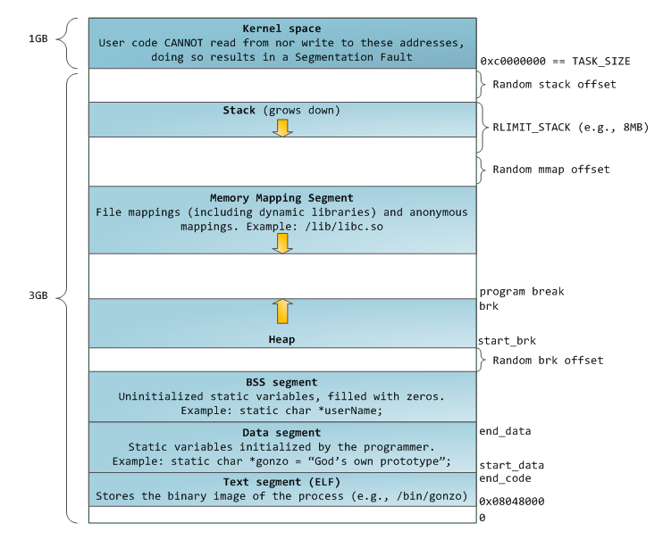
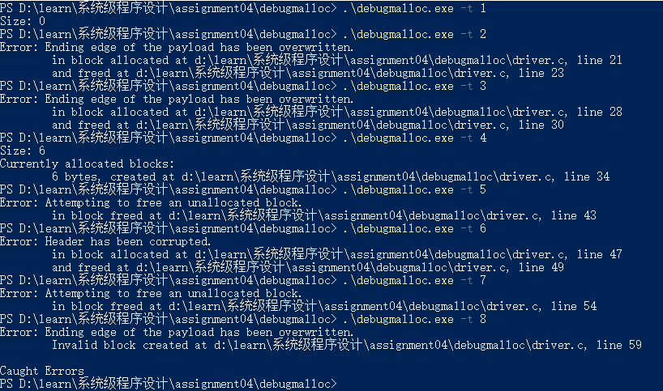

####Heap

Memory management is the heart of operating system. It is crucial for programming. Each process in a multi-task OS runs in its own memory sandbox, which is the virtual address space. In 32-bit mode is always a 4GB block of memory address. Normally, a block of memory address in each process contains serval memory segments like the heap, stack, text segment and so on. Here is the standard segment layout in a x86 Linux process:

<!--more-->



What I focus on is the heap this time. It is well know that almost all execution of functions and local variables are stored in the stack and heap. The heap is memory segment set for dynamic allocation. Unlike the stack, process can make the allocation and deallocation of blocks from the heap freely, just paying acceptable cost of time.

There are too many details about the heap, but in this experiment, the allocation and debugging of it is the point.

#### Malloc and Free

I believe everyone who use C or just know the pointer in C have used `malloc` before. `Malloc` is used so frequent that even some guys assume it is a system call. Literally, `malloc(3)` is a Standard C Library function. It calls `brk` or `sbrk` syscalls to allocate memory space. Thus, we can implement our custom`Malloc` function. It will be shown in the other document. The aim of this experiment is to wrap `Malloc` and `free` to catch errors in the code that calls `malloc` and `free`.

My strategy is to allocate extra memory space to store relative information like filename and line number. I use a linked list to store it.

```c
typedef struct{
	int size; // to record "available" size of the block
	char file[100]; // to save the filename of the code that calls malloc
	int line;
	void*p; // to store a pointer to the header of allocated memory block
	struct Information *next;
} Information ;
```

Also the linked list need a header for `malloc` or `free` to access each information of allocated memory block.

```c
static Information *root = NULL;
```

There are some basic operations on the linked list like inserting, deleting and finding.

```c
void insertNode(Information* p){
  if(root != NULL){
    Information *node = root;
    while(node->next){
      node = node->next;
    }
    node->next = p;
  }else{
    root = p;
  }
}

void deletedNode(void* p){
  if(root == NULL){
    return;
  }
  Information *node = root;
  if(root->p = p){
    node = root->next;
    free(root);
    root = node;
    return;
  }
  while(node->next!=NULL){
    Information *temp = node->next;
    if(temp->p == p){
      node->next = temp->next;
      temp->next = NULL;
      free(temp);
    }
    node = node->next;
  }
}
```

Step 1 is done. Now, focus on `MyMalloc`. To catch the errors, I allocate a header and a footer around the payload to save some stuff like the checkSum, size and the Fence. Here the fence is set as 0x7e arbitrarily. The checkSum just need to check the number of 1s in `size` because the value of the two fences are fixed. With the help of bitwise operations, the check is quite easy.

```c
int getOnes(int* des) {
	int x = 0;
	for (int i = 0; i < 32; i++) {
		if (((*des)&(1 << i)) != 0) {
			x++;
		}
	}
	return x;
}
```

So, I should allocated size+7, one byte for checksum, four bytes for the size and two bytes for two fence I have set. It may be confused lightly but it makes sense. What I need to do next is to assign specified values to the corresponding address.

```c
*(int*)(res + 1) = size+7; //set the size
*(char*)(res + 5) = 0x7e; //set the fence
*(char*)(res + size + 6) = 0x7e;
*(char*)res = getOnes((int*)(res + 1)); // set the checkSum
```

Then, allocate a `Information` block, set it well and add it to the linked list. Eventually return a pointer(`(void*)(res+6)`) to the payload. Here the first two steps is completed. Now, implement the one of the most crucial functions `myFree`.  The free operation not only does its own job but to catch error and display the concrete position of the code that calls malloc or free.

According to the assignment document, five errors need to catch.

- Error #1: Writing past the beginning of the user's block (through the fence)
- Error #2: Writing past the end of the user's block (through the fence)
- Error #3: Corrupting the header information
- Error #4: Attempting to free an unallocated or already-freed block
- Error #5: Memory leak detection (user can use ALLOCATEDSIZE to check for leaks at the end of the program)

Firstly, I need to get the `Information` block contains the pointer `ptr`. 

```c
	char *afile, *ffile;
	int anumber, fnumber;
	Information * node = findNode(((char*)ptr - 6));// get the address of real header
	ffile = filename;
	fnumber = linenumber;
// if node is null(freed or unallocated), it is error #4 case.
	if (node != NULL) {
	afile = node->file;
	anumber = node->line;
	}
	else {
		error(4, ffile, fnumber);
		return;
	}
```

Then, check the size to make sure it be the original one, it will catch error #3 otherwise. Check values of two fences to catch error #1 and error #2.

```c
	if (getOnes(p + 1) != sum) {
			errorfl(3,afile,anumber,ffile,fnumber);
			deleteHead(p);
			free(p);
			return;
		}
		int size = *((int*)(p + 1));
		if (*(p + size - 1)!=0x7e) {
			errorfl(2, afile, anumber, ffile, fnumber);
			deleteHead(p);
			free(p);
			return;
		}
		if (*(char*)(p + 5) != 0x7e) {
			errorfl(1, afile, anumber, ffile, fnumber);
			deleteHead(p);
			free(p);
			return;
		}
```

Everything is on foot. I finish the mainly functions the allocator `MyMalloc` and `MyFree` have. The next step is to implement the option functions and fill up some details.

There is one function I just forgot. Implement the function `AllocatedSize()`. It's simple that just use a global variable `allocatedNum` to record the total 'fake' size and add or minus it while calling `Malloc` and `Free`. Or, the other way is to compute the sum of size in every `Information` block. It is a little bit easy but I choose the former.

#### Optional functions

Because I have built a linked list to store all information, just traverse the linked list, get the information and print it by the macro `PRINTBLOCK`.

```c
void PrintAllocatedBlocks() {
	int i = 0;
	if (root == NULL) {
		return;
	}
	printf("Currently allocated blocks:\n");
	Information *p = root;
	PRINTBLOCK(p->size, p->file, p->line);
	while (root->next){
		PRINTBLOCK(p->size, p->file, p->line);
		p = p->next;
	}
	return;
}
```

The last one, `HeapCheck` checks all of the currently allocated blocks and return -1 if there is an error and 0 if all blocks are valid. Thus, just insert a check operation on a single block when we traverse the linked list.

```c
int check(Information*ptr) { // almost the same with the free operation
	char* cfile;
	int cline;
	if (ptr->p != NULL) {
		char* p = ptr->p;
		cfile = ptr->file;
		cline = ptr->line;
		int sum = *p;
		if (getOnes(p + 1) != sum) {
			PRINTERROR(3, cfile, cline);
			return -1;
		}
		int size = *((int*)(p + 1));
		if (*(p + size - 1) != 0x7e) {
			PRINTERROR(2, cfile, cline);
			return -1;
		}
		if (*(char*)(p + 5) != 0x7e) {
			PRINTERROR(1,cfile,cline);
			return -1;
		}
	}
	return 0;
}
int HeapCheck() {
	if (root == NULL)
		return 0;
	Information *p = root;
	if (check(p) == -1) {
		return -1;
	}
	while (p->next) {
		if (check(p->next) == -1)
			return -1;
		p = p->next;
	}
	return 0;
}
```

Here are results of test cases:



#### Conclusion

Heap is very significant for both programming itself and programmers. This experiment gives me a chance to have a very deep understanding about the heap and Linux also. I perused a post([A quick tutorial on implementing and debugging malloc, free, calloc, and realloc](http://danluu.com/malloc-tutorial/)) the TA has given before. There is no deny it gave me a very clear understanding about malloc, free and so on. Also, I find a post([Anatomy of a Program in Memory](http://duartes.org/gustavo/blog/post/anatomy-of-a-program-in-memory/)) by Gustavo Duarte the tutorial mentioned. It talks about memory segment very clearly and closely. I consulted it and wrote the header of the document.


