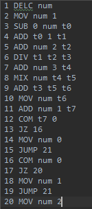
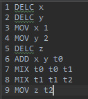

#### 1.添加16进制整数赋值

- 首先修改语法，在g4文件中添加如下语法

  ```
  INT:  ('0'|([1-9]([0-9])*))|('0x0'|'0x'[1-9a-f][0-9a-f]*); 
  ```

- 修改`MyCBaseListener`中`exitAssign()`方法，添加一下代码即可：

  ```java
  if(ctx.expr().value.contains("0x")){
              ctx.expr().value = String.valueOf(Integer.parseInt(ctx.expr().value.substring(2), 16));
          }
  ```

<!--more-->

#### 2.实现多行注释

- 修改语法，添加跳过多行注释的功能：

  ```
  Mul_COMMENT: '/*' ().*? '*/' {skip();};
  ```

#### 3.添加除法运算，补充乘除操作功能

- 第一步添加语法规则，如下：

  ```
  expr2: expr2 (mix=MIX|div = DIV) expr3 | expr3; 
  ```

- 补充`MyCBaseListener`中`exitExpr2()`方法，关键代码如下：

  ```java
  ...
    //乘法部分
    CodeOrganizer.getCodeOrganizer().code.add(CodeOrganizer.getCodeOrganizer().line+" MIX " + ctx.expr2().value + " " + ctx.expr3().value + " " + ctx.value);
  //除法部分
   CodeOrganizer.getCodeOrganizer().code.add(CodeOrganizer.getCodeOrganizer().line+" DIV " + ctx.expr2().value + " " + ctx.expr3().value + " " + ctx.value);
  ```

#### 4.添加else语句

- 添加语法规则：

  ```
  ifStmt: ifKeyWord=IF lsBkt=L_S_BKT expr rsBkt=R_S_BKT llBkt=L_L_BKT stmts lrBtk=R_L_BKT (elseStmt= Else llBkt = L_L_BKT stmts lrBtk=R_L_BKT )? ; //if else语句
  ```

- 修改原始if的翻译操作，由于之前使用唯一的`{`来标记if语句不可用，所以单独使用一个`isIf`变量来标记`{...}`块是否为if语句。同时，添加else语句后，if代码块中的语句执行结束后需要`JUMP`操作，调到else代码块之后。相关代码如下：

  ```java
  public void visitTerminal(TerminalNode node) {
          //左大括号出现在if,else语句中，可使用{和isIs变量共同标识地址
      if (node.getText().equals("{")) {
          if (isIf) {
              CodeOrganizer.getCodeOrganizer().code.add(CodeOrganizer.getCodeOrganizer().line +" COM ??? 0");
              CodeOrganizer.getCodeOrganizer().line++;
              CodeOrganizer.getCodeOrganizer().code.add(CodeOrganizer.getCodeOrganizer().line +" JZ ???");
              CodeOrganizer.getCodeOrganizer().line++;
          } else {
              ArrayList<String> list = CodeOrganizer.getCodeOrganizer().code;
              for (int i = list.size() - 1; i >= 0; i--) {
                  String s = list.get(i);
                  if (s.contains("???")) {
                      list.set(i, s.replace("???", CodeOrganizer.getCodeOrganizer().line + 1 + ""));
                      break;
                  }
              }
    CodeOrganizer.getCodeOrganizer().code.add(CodeOrganizer.getCodeOrganizer().line + " JUMP !!!");
              CodeOrganizer.getCodeOrganizer().line++;
          }
      }
      if (node.getText().equals("if")) {
          isIf = true;
      }
      if (node.getText().equals("else")) {
          isIf = false;
      }
  }
  public void exitIfStmt(MyCParser.IfStmtContext ctx) {
      ArrayList<String> list = CodeOrganizer.getCodeOrganizer().code;
      String location = ctx.expr().value;
      for (int i = list.size() - 1; i >= 0; i--) {
          String s = list.get(i);
          if (s.contains("!!!")) {
              list.set(i, s.replace("!!!", String.valueOf(CodeOrganizer.getCodeOrganizer().line)));
          }
          if (s.contains("???")) {
              if (s.contains("JZ")) {
                  list.set(i, s.replace("???", String.valueOf(i + 2)));
                  i--;
                  s = list.get(i);
                  }
                  list.set(i, s.replace("???", location));
                  System.out.println(location);
                  break;
             }
         }
      }
  }
  ```

#### 5.实现四则运算优化

- 优化的目标是让所有相同运算只运算一次，关键是获取`TemplateVariable`时，如果之前已经有了相同运算，则直接给其之前运算的变量名，并消除本次操作。

- 检测之前是否有相同运算操作放在获取临时变量时，代码如下：

  ```java
  public String getTemplateVariable(String op,String l,String r){
          ArrayList<String> list = CodeOrganizer.getCodeOrganizer().code;
          if(list.size()==0)
              return getTemplateVariable();
          for(int i =list.size()-1;i>=0;i--){
              String s = list.get(i);
              if(s.contains(op)){
                  StringTokenizer stringTokenizer = new StringTokenizer(s," ");
                  stringTokenizer.nextToken();
                  if(stringTokenizer.hasMoreTokens()&&stringTokenizer.nextToken().equals(op)){
                      if(stringTokenizer.hasMoreTokens()&&stringTokenizer.nextToken().equals(l)){
                          if(stringTokenizer.hasMoreTokens()&&stringTokenizer.nextToken().equals(r)){
                              if(stringTokenizer.hasMoreTokens()){
                                  String s1 = stringTokenizer.nextToken();
                                  variables.add(s1);
                                  return s1;
                              }
                          }
                      }
                  }
              }
          }
          return getTemplateVariable();
      }
  ```

- 并且保存一张临时变量的表，便于之后查找临时变量，给变量赋值时使用；

- 同时，在`MyCBaseListener`中，修改所有四则运算时的代码，添加一步临时变量检测操作，检测该变量是否为新生成的临时变量，如果是新生成的，添加四地址码，否则跳过。这样，优化工作已经完成。

#### 示例

1. 输入：

   ```
   int num;
   num = 0x1;
   num=(-num+1)/(num+2)+num*(num+3);//num混合运算

   if(num+1){
       num=0;
   }else{
       if(num){
           num=1;
       }else{
           num=2;
       }
   }
   /*
   *多行注释
   */
   ```

   结果：

   

2. 输入：

   ```
   int x;
   int y;
   x=1;
   y=2;
   int z;
   z=((x+y)*(x+y))*((x+y)*(x+y));
   ```

   输出：

   