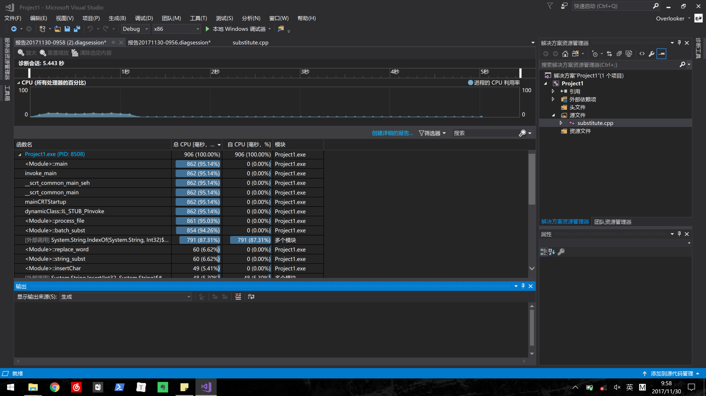
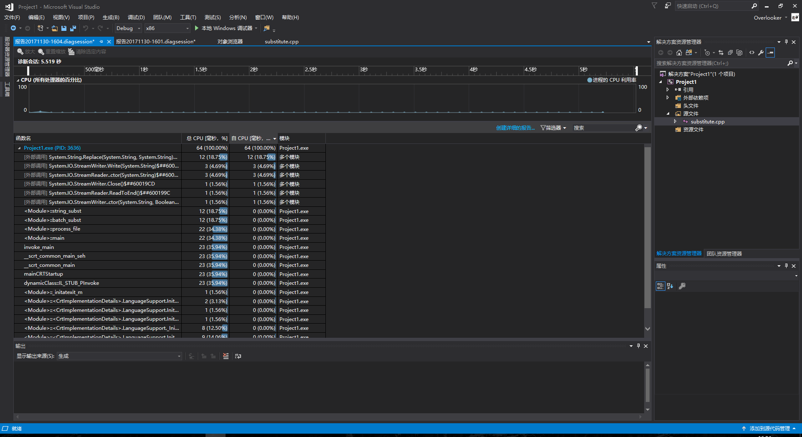
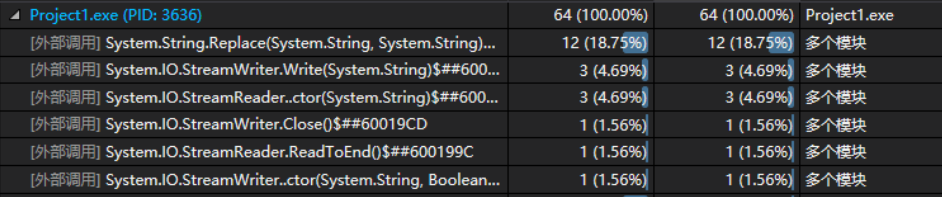
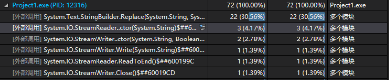

#### Analyze the bottlenecks



Before running the program, what I focus on to optimize is codes related to String, malloc, and high time complexity. I notice the index operation in the program and my guess proves right.

<!--more-->

A bottleneck can be definitely detected in CPU usage when the program runs without any optimizations. The **System.String.IndexOf** takes a large number of CPU time because the time complexity is O(nm), m means the number of replaced words, which is not a linear time complexity. Thus, the key is just to traverse file only once. It's easier and cheaper than use **IndexOf** each time to replace words.

Before:

```c++
String^ string_subst(String ^data, String ^pattern, String ^replacement) {
	try {
			int loc;
			// find every occurrence of pattern:
			for (loc = data->IndexOf(pattern, 0); loc >= 0;
				loc = data->IndexOf(pattern, 0)) {
				// replace word
				data = replace_word(data, loc, pattern->Length, replacement);
              
			}
      		//O(n^2)
			return data;
	} catch (Exception ^e) {
		Console::WriteLine("Error in substitute ");
		Console::WriteLine(e->ToString());
		return data;
	}
}
```

After:

```c++
String^ string_subst(String ^data, String ^pattern, String ^replacement) {
	try {
			return data->Replace(pattern, replacement);
	} catch (Exception ^e) {
		Console::WriteLine("Error in substitute ");
		Console::WriteLine(e->ToString());
		return data;
	}
}
```

I use **System.String.Replace** to do that thing. It performs more than ten times faster than the original one. 



I have read a funny [blog](https://blogs.msdn.microsoft.com/debuggingtoolbox/2008/04/02/comparing-regex-replace-string-replace-and-stringbuilder-replace-which-has-better-performance/) on Microsoft Developer. It shows a small Lab to test three of case-insensitive methods, **String.Replace**, **RegEx.Replace** and **StringBuilder.Replace**. Which one is the fastest to replace words. It proves String.Replace is the best one. Thus, I choose to use that one not **RegEx.Replace** or **StringBuilder.Replace**.

String.Replace:



StringBuilder.Replace:



The result sounds quite good. The program performs 906/70=12.94 times faster than before. 