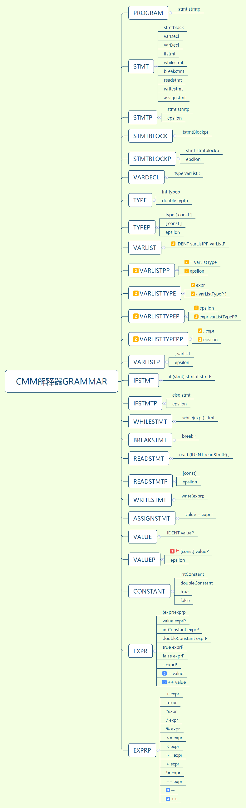
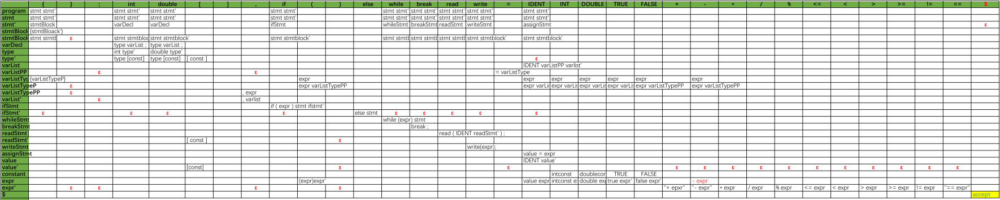
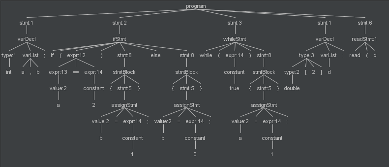

## CMM 语法分析器

#### 1.使用Antlr进行词法分析

- 之前的两次实验已经成功使用Antlr4生成词法分析器，下面简单介绍一下cmm的词法以及antlr的使用；

- 词法：

  ```java
  IDENT: [A-Za-z_][A-Za-z0-9_]*;
  INTCONSTANT: [0-9]+;
  DOUBLECONSTANT: [0-9]*'.'[0-9]+ ;
  "{","}",";","int","double","[","]",",","if","(",")"
  "else","while","break","read","write","=","true","false"
  "+","-","*","/","<","<=",">",">=","!=","=="
  ```
  <!--more-->

- 可以使用antlr生成词法分析器，CMM.g4文件的内容如下：

  ```java
  grammar CMM;
  program :  stmt+;
  stmt : varDecl | ifStmt | whileStmt | breakStmt | assignStmt | readStmt | writeStmt | stmtBlock;
  stmtBlock :  '{'  stmt* '}';
  varDecl : type varList ';';
  type : 'int' | 'double' | type '[' INTCONSTANT ']';
  varList : IDENT ( ',' IDENT )?;
  ifStmt : 'if' '(' expr ')' stmt ( 'else' stmt )?;
  whileStmt : 'while' '(' expr ')' stmt;
  breakStmt : 'break' ';';
  readStmt	 : 'read' '(' IDENT | (IDENT'['INTCONSTANT']')  ')'';';
  writeStmt : 'write''('expr')'';';
  assignStmt : value '=' expr ';';
  value : (IDENT '['INTCONSTANT']') | IDENT;
  constant : INTCONSTANT | DOUBLECONSTANT | 'true' | 'false';
  expr : expr ' +' expr | expr '–' expr | expr '*' expr | expr '/' expr | expr '%' expr | '-' expr | expr '<=' expr | expr '<' expr | expr '>' expr | expr '>=' expr | expr '!=' expr | expr '==' expr | value| constant
  |'('expr')';

  IDENT: [A-Za-z_][A-Za-z0-9_]*;
  INTCONSTANT: [0-9]+;
  DOUBLECONSTANT: [0-9]*'.'[0-9]+ ;
  WS : [ \t\r\n]+ -> skip;
  //这里只使用antlr的词法分析器，生产的parser并未使用；
  ```

- 到这里，可以使用CMMLexer分析`cmm`代码，下面是相关实例及结果：

  ```java
  CMMLexer cmmLexer = new CMMLexer(inputStream);
  for(Token token:cmmLexer.getAllTokens()){
      System.out.print(token.getText()+" ");
  }
  ```

  Input:

  > int a=((1+1)/2-4)*5;


  Output:

  > int a = ( ( 1 + 1 ) / 2 - 4 ) * 5 ;

#### 2.Parser

- 自顶向下——LL1文法

  LL1文法顾名思义是向后看一个`token`的从左向右扫描，最左推导的文法。原始的cmm语法并不是ll1文法（有左递归和共同左因子），因此要对原始语法进行处理。处理后的语法如下图：

  

注意：其中标记为1和2的语法是后添加入cmm的语法，1实现了cmm变量声明的同时进行赋值，并且支持一维数组，2实现了多维数组单个元素的赋值；3中的++，--操作尚未添加。

- 消灭了左递归和公共左因子之后，变成了LL1文法。相关的LL1预测分析表如下：



- 那么实现parser的所有准备都做好了，开始进行`parser`的实现；

- 我们需要一个`Symbol`抽象类，所有的终结符`TerminalSymbol`和非终结符`NonTerminalSymbol`都继承它；这里`Symbol`也充作AST的结点类，所以需要一个结点的集合和添加子结点的方法；同时也需要添加一个expand接口，做非终结符推测操作的接口。下面是Symbol的相关代码：

  ```java
  abstract class Symbol
  {
    private ArrayList<Symbol> nodes = new ArrayList<Symbol>();
    Symbol addNode(Symbol node){
      nodes.add(node);
      return node;
    }   
    abstract void expand(Stack<Symbol> stack, Queue<Token> queue) throws Exception;
  }
  ```

- `NonTerminalSymbol`类的实现比较简单，只需要保存对应token的类型即可；并且实现expand方法。

  ```java
  class TerminalSymbol extends Symbol {
      int getType() { return type; }
      private int type;
      TerminalSymbol(int t) { type = t; }
      private boolean typeEqual(Token token) { return type == token.getType(); }
      @Override
      void expand(Stack<Symbol> stack, Queue<Token> queue) throws Exception {
          if (typeEqual(queue.peek())) {
              queue.poll();
          } else {
              if (queue.peek() == null) {
                  throw new Exception("Some errors near the end");
              } else {
                //遇见对应的token直接弹出栈，并指向下一个token
                  throw new TokenException(queue.peek());
              }
          }
      }
  }
  ```

- `TerminalSymbol`类需要包含终结符的类型，以及所有类型对应的推导语法。下面是部分代码：

  ```java
    @Override
      void expand(Stack<Symbol> stack, Queue<Token> queue) throws Exception {
          Token token = queue.peek();
          System.out.println(type+token.getText());
          if (type.equals(Type.program)) {
              program(stack, token);
          }else if(type.equals(Type.stmt)){
              stmt(stack,token);
            ...
              
   private void program(Stack<Symbol> stack, Token token) throws Exception {
          switch (token.getType()) {
              case TleftBrace:
              case Tint:
              case Tdouble:
              case Tif:
              case Twhile:
              case Tbreak:
              case Tread:
              case Twrite:
              case Tident:
                  stack.push(addNode(new NonTerminalSymbol(Type.stmtP)));
                  stack.push(addNode(new NonTerminalSymbol(Type.stmt)));
                  break;
              default:
                  throw new TokenException(token);
          }
      }

      private void stmt(Stack<Symbol> stack, Token token) throws Exception {
          switch (token.getType()) {
              case TleftBrace:
                  stack.push(addNode(new NonTerminalSymbol(Type.stmtBlock)));
                  break;
              case Tint:
              case Tdouble:
                  stack.push(addNode(new NonTerminalSymbol(Type.varDecl)));
                  break;
              case Tif:
                  stack.push(addNode(new NonTerminalSymbol(Type.ifStmt)));
                  break;
              case Twhile:
                  stack.push(addNode(new NonTerminalSymbol(Type.whileStmt)));
                  break;
              case Tbreak:
                  stack.push(addNode(new NonTerminalSymbol(Type.breakStmt)));
                  break;
              case Tread:
                  stack.push(addNode(new NonTerminalSymbol(Type.readStmt)));
                  break;
              case Twrite:
                  stack.push(addNode(new NonTerminalSymbol(Type.writeStmt)));
                  break;
              case Tident:
                  stack.push(addNode(new NonTerminalSymbol(Type.assignStmt)));
                  break;
              default:
                  throw new TokenException(token);
          }
      }
  ```

- 下面是`Parser`的实现，用一个栈模拟LL1的递归推导。

  ```java
   public void paser(){
          if(tokens.size()<=0){
              return;
          }
          Stack<Symbol>stack = new Stack<Symbol>();
          stack.push(NonTerminalSymbol.getDollarSymbol());
          root = NonTerminalSymbol.getProgramStmt();
          stack.push(root);
          Queue<Token> queue = new LinkedList<Token>();
          queue.addAll(tokens);
          ...
          while (!stack.empty()){
              try {
                  stack.pop().expand(stack,queue);
              } catch (Exception e) {
                  System.err.println(e.getMessage());
                  return;
              }
          }
      }
  ```

- 最后，添加语法分析时，报错信息的实现，由于antlr的token自带了位置信息，可以打印具体的行数和位置。所以很简单的继承一个`exception`。

  ```java
  class TokenException extends Exception{
      TokenException(Token token) {
          this("Error: line=" + token.getLine() + ", position=" + token.getCharPositionInLine() + ", Token: "+token.getText()+";");
      }
      
       private TokenException(String message) { super(message); }
  }
  ```

#### 示例

- test.in

  ```c++
  int a,b;
  if(a==2){
      b=1;
  }else{
      b=0;
  }

  while(true){
      a=1;
  }
  double[2] d;

  read(d[1]);
  write(d[0]);
  ```

  Output:

  > (type:program children:= (type:stmtP children:= (type:stmtP children:= (type:stmtP children:= (type:stmtP children:= (type:stmtP children:= ....
  >
  > //输出为前序遍历的语法树

  

