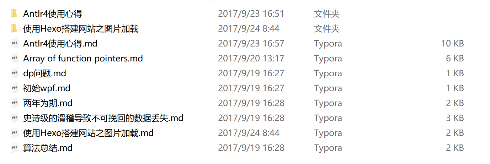

### 前提

​        之前用了一年多的Hexo搭建博客，十分爽利，但唯一不满意的就是无法像其他成熟的博客网站一样，直接添加图片。以前的做法很蠢，自己寻找在线图床，将图片上传后在替换url。但这样做有两个很不好的地方。其一，使用图床很麻烦，需要上传后再替换图片路径；其二，由于现在在线图床的质量参差不齐，好的图床需要付费，但最头疼的一点就是图床会在未来的某一时刻挂掉，那么自己的博客图片直接gg。

### 具体步骤

这里，只使用一种折衷的方法，我们依然需要使用在线图床，只不过使用的是自己的。这里需要一个hexo插件

> npm install hexo-asset-image --save

安装后，使用的步骤和之前使用图片一样，唯一的不同便是在博客文件的同一级文件夹下，新建一个同名文件，将图片放在这个文件夹里面就万事大吉，十分简单和方便。

下面是一个自己使用后的例子：

### 结语

最近事情比较多，没有好好静下心来更新博客，不过接下来会规律稳定地更新，写一点自己想写的东西和不多的技术性博客，23333333。